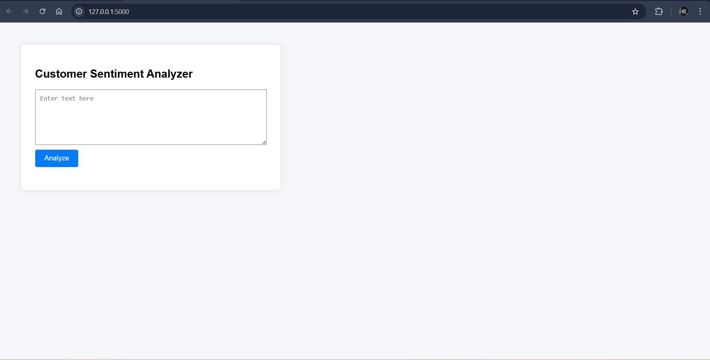

# Customer-sentiment-analysis
Customer Sentiment Analysis using Logistic Regression and Flask

## 📌 Overview
This project is an end-to-end Customer Sentiment Analysis system
that predicts whether a given text is Positive or Negative using
Logistic Regression and NLP techniques.

## 🧠 Problem Statement
Analyzing customer feedback manually is time-consuming.
This project automates sentiment detection using machine learning.

## ⚙️ Technologies Used
- Python
- Pandas, NumPy
- Scikit-learn
- TF-IDF Vectorizer
- Flask
- HTML, CSS

## 🧪 Model
- Logistic Regression for text classification

## 🖥️ Application Output
Users can enter text in a web interface and instantly
receive sentiment predictions.

## 🚀 How to Run
1. Clone the repository  
   git clone https://github.com/yourusername/customer-sentiment-analysis.git

2. Install dependencies  
   pip install -r requirements.txt

3. Run the app  
   python app.py

4. Open in browser  
   http://127.0.0.1:5000/

## 📌 Future Improvements
- Try additional ML models
- Improve text preprocessing
- Deploy online

👨‍💻 About the Creator:

**Venkatesh Parvatala**

Power BI Developer | Data Analyst
